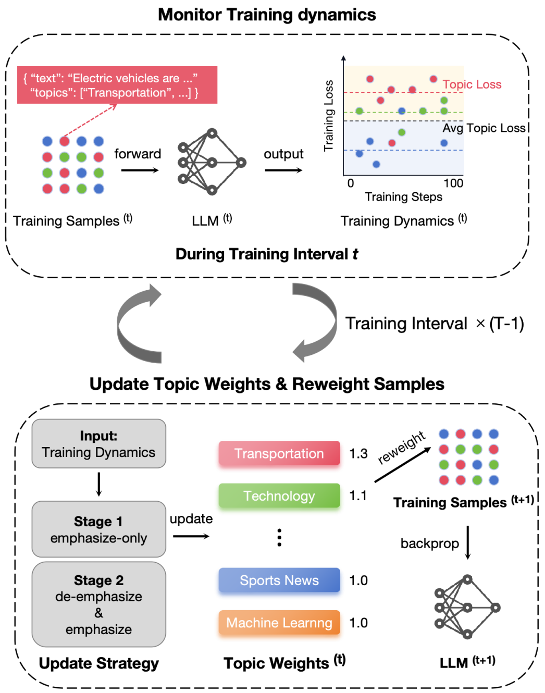

# ToReMi: Topic-aware Data Reweighting for Dynamic Pre-training Data Selection

[](https://arxiv.org/abs/2504.00695)
[](https://opensource.org/licenses/Apache-2.0)

Open Source implementation of the paper **ToReMi: Topic-aware Data Reweighting for Dynamic Pre-training Data Selection**.  
A novel two-stage framework for optimizing LLM pre-training through dynamic topic-based data reweighting.

**Authors**: Xiaoxuan Zhu*, Zhouhong Gu*, Suhang Zheng, Tao Wang, Tianyu Li, Hongwei Feng*, Yanghua Xiao*  
**Affiliations**: Fudan University & Alibaba Group  
**Contact**: {xxzhu22, zhgu22}@m.fudan.edu.cn



## 🔍 Overview

ToReMi introduces a **two-stage dynamic reweighting** mechanism for LLM pre-training:
1. **Stage 1**: Prioritizes challenging samples with high training loss for efficient knowledge acquisition
2. **Stage 2**: Downweights noisy samples while preserving critical information through topic-aware reweighting

Key features:
✅ Topic-aware data selection  
✅ Dynamic training adaptation  
✅ Noise-robust training  
✅ Accelerated convergence

## 🚀 Quick Start

### 1. Environment Setup
```bash
pip install -r requirements.txt
```

### 2. Data Preparation
```bash
# Step 1: Sample Dolma data
python3 dolma/sample_data.py \
  --dolma_dir /path/to/original_dolma \
  --save_dir /path/to/save_samples \
  --tokenizer_name gpt2 \
  --sampling_ratios "books:0.002,code:0.138,ref:0.025,web:0.835"

# Step 2: Add topic labels
python3 topic_annotation/1_clustering.py \
  --corpora_dir /path/to/sample_data/data_30B \
  --save_embedding_dir /path/to/embeddings \
  --save_cluster_dir /path/to/clustered_data \
  --fp16

python3 topic_annotation/2_extract_keywords.py \
  --cluster_dir /path/to/clustered_data \
  --save_keywords_dir /path/to/keywords \
  --top_n 150 \
  --lang english \
  --no_stopwords

python3 topic_annotation/3_classify_with_wiki.py \
  --keywords_dir /path/to/keywords/cluster_keywords.json \
  --save_topic_dir /path/to/topic_labels \
  --model_name llama3:70b 

python3 topic_annotation/4_add_classify_labels.py \
  --cluster_dir /path/to/clustered_data \
  --topic_dir /path/to/topic_labels/cluster_labels \
  --save_final_corpora_dir /path/to/final_dataset \
  --batch_size 128 \
```

### 3. Preprocessing
```bash
sh ./train/preprocess.sh
```

### 4. Training
```bash
# Launch pretraining with ToReMi
sh ./train/pretrain.sh
```

### 5. Evaluation
```bash
cd test
```

## 🤝 Citation
```bibtex
@misc{zhu2025toremitopicawaredatareweighting,
      title={ToReMi: Topic-Aware Data Reweighting for Dynamic Pre-Training Data Selection}, 
      author={Xiaoxuan Zhu and Zhouhong Gu and Suhang Zheng and Tao Wang and Tianyu Li and Hongwei Feng and Yanghua Xiao},
      year={2025},
      eprint={2504.00695},
      archivePrefix={arXiv},
      primaryClass={cs.CL},
      url={https://arxiv.org/abs/2504.00695}, 
}
```
